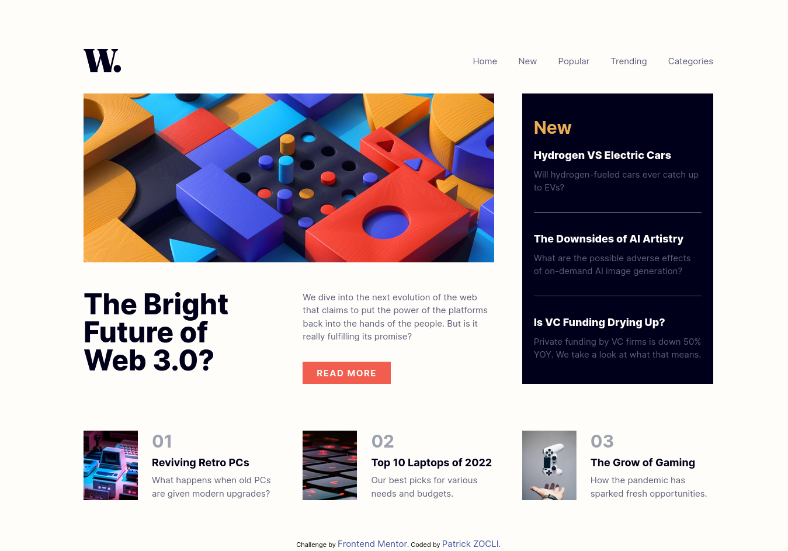
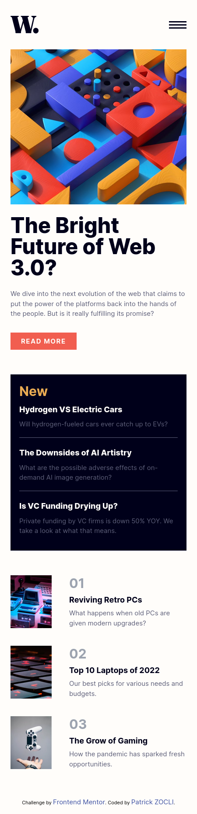
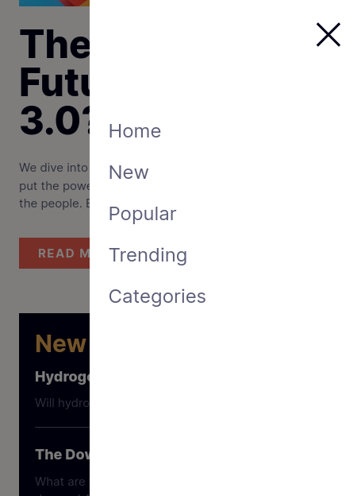

# Frontend Mentor - News homepage solution

This is a solution to the [News homepage challenge on Frontend Mentor](https://www.frontendmentor.io/challenges/news-homepage-H6SWTa1MFl). Frontend Mentor challenges help you improve your coding skills by building realistic projects. 

## Table of contents

- [Overview](#overview)
  - [The challenge](#the-challenge)
  - [Screenshots](#screenshot)
  - [Links](#links)
- [My process](#my-process)
  - [Built with](#built-with)
  - [What I learned](#what-i-learned)
  - [Continued development](#continued-development)
- [Author](#author)

## Overview

### The challenge

Users should be able to:

- View the optimal layout for the interface depending on their device's screen size
- See hover and focus states for all interactive elements on the page
- **Bonus**: Toggle the mobile menu (requires some JavaScript)

### Screenshots

### Links

- Solution URL: [https://github.com/Patzi275/news-home-page](https://github.com/Patzi275/news-home-page)
- Live Site URL: [http://patzi275-news-home-page.surge.sh](http://patzi275-news-home-page.surge.sh)

## My process

### Built with

- Semantic HTML5 markup
- [Tailwind](https://tailwindcss.com)(Just for training xD) - CSS framework
- Mobile-first workflow
- [BEM](https://getbem.com) - A CSS convention

### What I learned

There, i learned how to use grid efficiently with Tailwind and the mobile-first workflow. 
It is something I did without knowing it.

### Continued development

Things that can make this site better are:
- Animation as soon as the page load
- Carousel of main articles

## Author

- Frontend Mentor - [@patzi275](https://www.frontendmentor.io/profile/patzi275)
- Twitter - [@patzidev](https://www.twitter.com/patzidev)